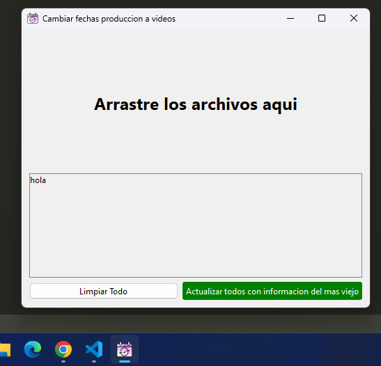
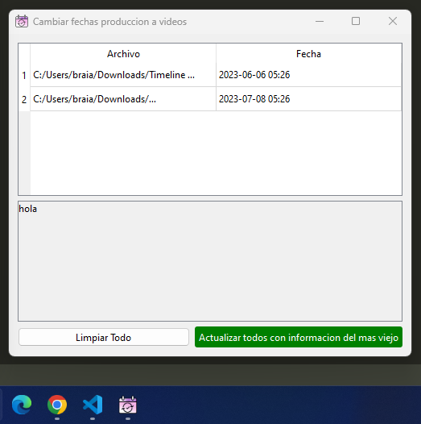

Cambiar Fechas
==============

Aplicacion que permite actualizar la fecha de produccion de varios archivos de video a la fecha del mas antiguo

| Al abrir la aplicación | Como se ve con archivos |
|-----------------------|------------------------|
|  |  |

#### Al arrastrar archivos

Icono
-----

El icono utilizado en este proyecto fue creado por [BECRIS](https://freeicons.io/profile/3484) y se obtuvo de [freeicons.io](https://freeicons.io).

Instalación y configuración
---------------------------

1.  Clona el repositorio en tu máquina local.
    
2.  Crea un entorno virtual e instala las dependencias utilizando el siguiente comando:
    
    Copy code
    
    `pip install -r requirements.txt`
    
3.  Activa el entorno virtual antes de ejecutar la aplicación:
    
    *   En Windows:
        
        bashCopy code
        
        `./env/Scripts/Activate.ps1`
        
    *   En Linux/Mac:
        
        bashCopy code
        
        `source env/bin/activate`
        

Ejecución
---------

Para ejecutar la aplicación, utiliza el siguiente comando:

cssCopy code

`python src/main.py`

Crear ejecutable
----------------

Puedes crear un archivo ejecutable utilizando PyInstaller con los siguientes comandos:

Modo productivo (sin consola):

bashCopy code

`pyinstaller --distpath=".\dist" --onefile --noconsole --add-data "3792137161586787349-128.png;." --name "cambiar-fechas" ".\src\main.py"`

Modo con consola (para ver la salida):

bashCopy code

`pyinstaller --distpath=".\dist" --onefile --icon ".\3792137161586787349-128.ico" --name "cambiar-fechas" ".\src\main.py"`